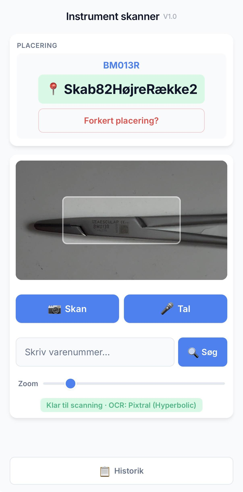

# Instrument Scanner PWA

A mobile-optimized Progressive Web App (PWA) for scanning instrument part numbers and looking up their storage locations in a CSSD (Central Sterile Supply Department).

Built to replace a manual lookup workflow in a sterile services department. Staff previously had to look up instrument storage locations on a PC and write them on post-its — for every single instrument. This app lets you point your phone camera at a part number and get the answer immediately.

It uses the camera, voice input, and manual entry to find part numbers quickly, with secure server-side OCR via Netlify Functions.

> **Source-only:** This repo ships without private keys, production deployment settings, or hosted infrastructure. Connect it to your own Netlify account for a live deployment.

## Screenshots



## Features

- 📷 **Camera OCR** — scan part numbers with your phone camera using Pixtral-12B (Hyperbolic) with automatic Gemini 2.5 Flash Lite fallback
- 🎤 **Voice Input** — Danish speech recognition with fuzzy DB matching for low-confidence reads
- ⌨️ **Manual Entry** — type part numbers directly with auto-suggest
- 🔍 **Fuzzy Matching** — suggests similar part numbers with character-swap correction (O↔0, I↔1, S↔5, B↔8, Z↔2, M↔O)
- 🧠 **Local OCR** — optional browser-side OCR via Florence-2 (Tesseract disabled; accuracy on label images was insufficient)
- 📜 **History** — quick access to recent lookups, sortable by latest, location, or alphabetically
- 📱 **PWA** — install on your home screen for native-like experience
- 🔒 **Secure** — API keys stay server-side via Netlify Functions
- 🌐 **Offline Support** — service worker caching for offline use
- 🔑 **Authentication** — shared password protection with 30-day sessions and rate limiting
- 📊 **Usage Stats** — optional monthly OCR usage tracking via Netlify Blobs

## What's New (v1.4.0)

- **M→O correction** — OCR often misreads O as M in EO-prefix part numbers; the scorer now tries the M→O variant and prefers the DB match without penalizing O as ambiguous
- **Sharpness gating** — blurry images are rejected before any OCR call; very sharp images skip preprocessing to avoid artifacts
- **Sequential OCR attempts** — attempts fire one at a time and stop at the first successful result, avoiding unnecessary API calls
- **Per-attempt timeouts** — initial attempt gets 4.5s, retries get progressively shorter (3s → 2.2s)
- **Improved voice recognition** — unified rule-based normalization, DSP audio stream activation, fuzzy DB matching for low-confidence transcripts, noise transcript rejection
- **Auth hardening** — `AUTH_PASSWORD` is no longer strictly required in dev; falls back to `AUTH_TOKEN_SECRET` default in production checks
- **Database growth** — hundreds of new part numbers and location entries

## Requirements

- Node.js 18+
- [Netlify CLI](https://docs.netlify.com/cli/get-started/) (`npm install -g netlify-cli`)
- A [Hyperbolic](https://app.hyperbolic.xyz/) API key for primary OCR
- (Optional) An [OpenRouter](https://openrouter.ai/) API key for fallback OCR
- A Netlify account if you want to deploy

## Quick Start

### 1. Clone and install

```bash
git clone <your-repo-url>
cd iskanner-public
npm install
```

### 2. Configure environment variables

```bash
cp .env.example .env
```

Edit `.env` — at minimum set the OCR API key and a token secret:

```bash
# Primary OCR provider (Pixtral-12B-2409 via Hyperbolic)
HYPERBOLIC_API_KEY=your_hyperbolic_api_key_here

# Token secret for session signing
AUTH_TOKEN_SECRET=your_secret_token_here

# App password (optional in dev, required in production)
AUTH_PASSWORD=change-me-in-production

# Optional fallback OCR provider (Gemini 2.5 Flash Lite via OpenRouter)
# OPENROUTER_API_KEY=your_openrouter_api_key_here

# Optional CORS restrictions
# ALLOWED_ORIGINS=https://yourdomain.com
```

### 3. Run locally

```bash
npm run dev
```

Open http://localhost:8888 in your browser.

> **Important:** Authentication and OCR only work through Netlify Dev. Opening `index.html` directly will show network errors on login.

## Deployment

### Netlify setup (one-click)

1. Push this repo to GitHub
2. Connect the repo to Netlify (it auto-detects the build settings from `netlify.toml`)
3. Add these environment variables in Netlify:

| Variable | Required | Description |
|----------|----------|-------------|
| `HYPERBOLIC_API_KEY` | Yes | Primary OCR provider API key |
| `AUTH_TOKEN_SECRET` | Yes | Secret for signing session tokens |
| `OPENROUTER_API_KEY` | No | Fallback OCR provider API key |
| `OCR_PRIMARY_PROVIDER` | No | Provider to use first (`hyperbolic` or `openrouter`) |
| `OCR_FALLBACK_PROVIDER` | No | Fallback provider |
| `HYPERBOLIC_OCR_MODELS` | No | Comma-separated model list for Hyperbolic |
| `OPENROUTER_OCR_MODELS` | No | Comma-separated model list for OpenRouter |
| `ALLOWED_ORIGINS` | No | Comma-separated allowed CORS origins |
| `NETLIFY_SITE_ID` | No | Required for usage stats (Netlify Blobs) |
| `NETLIFY_BLOBS_TOKEN` | No | Required for usage stats (Netlify Blobs) |

4. Deploy — Netlify will auto-deploy on every push to the configured branch

### Authentication

The app uses a shared password with 30-day sessions:

- **Default password:** `Agent007` (change in `netlify/functions/auth.js` if needed)
- **Session duration:** 30 days per device
- **Rate limiting:** 50 OCR requests/min for authenticated users; unauthenticated users have no OCR access
- **Login prompt:** Appears automatically on first use

## Customization

### Parts database

Edit `parts-database.js` to add your own part numbers and locations:

```javascript
const partsDatabase = {
    'ABC123': 'Storage Cabinet 4, Shelf 2',
    'XYZ-789': 'Drawer 12, Bin 7',
    // Add more entries...
};
```

### OCR configuration

Edit `js/config.js` to tune:

| Setting | Default | Description |
|---------|---------|-------------|
| `CAMERA_INACTIVITY_TIMEOUT_MS` | 60000 | Auto-stop camera after inactivity |
| `VOICE_TIMEOUT_MS` | 10000 | Voice recognition timeout |
| `MAX_RECENT_LOOKUPS` | 50 | History limit |
| `JPEG_QUALITY` | 0.78 | Camera capture quality |
| `OCR_CROP_Y_BIAS_RATIO` | 0 | Vertical crop alignment (0 = centered) |

### OCR provider chain

Control the provider chain with environment variables:

```bash
OCR_PRIMARY_PROVIDER=hyperbolic       # or 'openrouter'
OCR_FALLBACK_PROVIDER=openrouter      # or leave empty for no fallback
HYPERBOLIC_OCR_MODELS=mistralai/Pixtral-12B-2409
OPENROUTER_OCR_MODELS=google/gemini-2.5-flash-lite
```

The app tries attempts sequentially: raw image → preprocessed variants. On each attempt it:
1. Checks sharpness (rejects blurry images immediately)
2. Attempts local OCR (Florence-2) in-browser if loaded
3. Falls back to the cloud provider chain (Hyperbolic → OpenRouter)
4. Returns the first valid part number found

## Usage

1. Open the app on your phone
2. Enter the password (shown on first visit)
3. Tap **Scan** to open the camera; tap again to capture
4. Or tap **Tal** to use voice input (Danish) — say the part number clearly
5. Or type a part number manually in the search field
6. Tap **Historik** to browse recent lookups (sortable by latest, location, or alphabetically)

### Voice input tips

- Speak clearly, one part number at a time
- Danish letter names are supported: "em" → M, "el" → L, "hå" → H, "zek" → C, "zet" / "set" → Z
- Numbers can be spoken in Danish or English
- Punctuation: "streg" → `-`, "prik" / "punktum" → `.`
- Low-confidence matches will show a "Did you mean?" suggestion

## Project structure

```text
├── index.html              # Main app HTML
├── css/styles.css          # Stylesheet with CSS variables
├── icons/                  # PWA icons (various sizes)
├── js/
│   ├── app.js              # Main app logic & routing
│   ├── auth.js             # Authentication (password + session)
│   ├── camera.js           # Camera capture & cropping
│   ├── config.js           # App configuration constants
│   ├── local-ocr.js        # Browser-side OCR (Florence-2, optional)
│   ├── ocr.js              # OCR pipeline (cloud + local)
│   ├── ui.js               # DOM updates & haptics
│   ├── utils.js            # Helpers: part number normalization, scoring, DB lookup
│   └── voice.js            # Speech recognition (Danish)
├── netlify/functions/
│   ├── auth.js             # Auth endpoint (login + session verification)
│   ├── ocr.js              # Serverless OCR proxy (Hyperbolic → OpenRouter fallback)
│   └── ocr-usage.js        # Monthly usage statistics endpoint
├── parts-database.js       # Part number → location mapping
├── tests/
│   ├── ocr.test.js         # OCR scoring & correction tests
│   └── voice.test.js       # Voice normalization tests
├── screenshots/
│   └── screenshot.jpg      # App screenshot
├── manifest.json            # PWA manifest
├── sw.js                   # Service worker (cache-first strategy)
├── netlify.toml            # Netlify deployment config
├── .env.example            # Environment variable template
└── package.json            # Dependencies & dev scripts
```

## Security

- API keys live server-side in Netlify Functions — never exposed to the client
- Auth tokens are signed with `AUTH_TOKEN_SECRET` and expire after 30 days
- OCR requests are rate-limited per session (50 req/min)
- CORS origin checks prevent unauthorized API access
- Service worker caches only static app assets, never sensitive data
- `AUTH_TOKEN_SECRET` now has a safe default for local development (set a strong value in production!)

## Troubleshooting

**Buttons don't respond**
- Ensure the app runs through Netlify Dev (`npm run dev`), not directly from the file system
- Clear the service worker cache if upgrading from an older version
- Check the browser console for JavaScript errors

**Login fails locally**
- Run `npm run dev` — opening `index.html` directly won't work with auth
- Make sure `AUTH_TOKEN_SECRET` is set in your `.env` file

**OCR returns no result**
- Verify `HYPERBOLIC_API_KEY` is set correctly
- Check the image is well-lit and in focus (the app now rejects blurry images with a clear message)
- Add `OPENROUTER_API_KEY` for fallback OCR if Hyperbolic fails
- Check Netlify Function logs for API error details

**Voice input doesn't work in PWA**
- Speech recognition requires a browser context; open in Safari instead of the home-screen app
- On iOS, ensure microphone access is granted in Safari settings

**Test failures**
```bash
npm test
```
Runs the OCR scoring and voice normalization test suite.

## License

MIT
